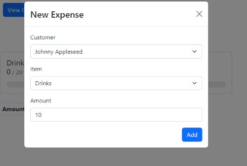

## H.O.T.E.L.

This project was bootstrapped with [Create React App](https://github.com/facebook/create-react-app).

## Inspiration
In busy holiday seasons, hotel rooms sell like hotcakes. Each room is worth a lot of money and no-shows can be damaging to a hotel's revenue. This was my inspiration for creating H.O.T.E.L. (Hospitality Online Ticketing Evaluation and Logistics).

## Purpose
The purpose of this project was to create a machine learning algorithm to predict whether customers would show up and then integrate that into an entire Hotel Management application that can track customer information as well as inventory and customer use history.

## How I built it

I built the algorithm using a Jupyter Notebook and libraries such as the Natural Learning Toolkit (NLTK) library, pandas, regular expressions (re), Sci-kit Learn, and the string library. After cleaning and testing various parameter settings with GridSearchCV, I ended up with 80% accuracy. Then, I created the frontend with React. I used React-bootstrap for the CSS elements and then moved on to the backend. This was created using Flask. I created an api to process the data that the user enters and predict whether the customer would show up or not. Then, I integrated an inventory management system that allows the hotel to manage inventory of various products. Also, I integrated a history log of when customers used specific products.

Adding Customers:

Viewing customer information as well as predicted status:

Adding an item to inventory:

Adding an expense to inventory:

Inventory Dashboard:

## Available Scripts

In the project directory, you can run:

### `npm start`

Runs the app in the development mode.\
Open [http://localhost:3000](http://localhost:3000) to view it in your browser.

The page will reload when you make changes.\
You may also see any lint errors in the console.

### `flask run`

Runs the flask backend in debug mode.

If there are any issues please feel free to contact me at: sanjaytaylor2012@gmail.com

